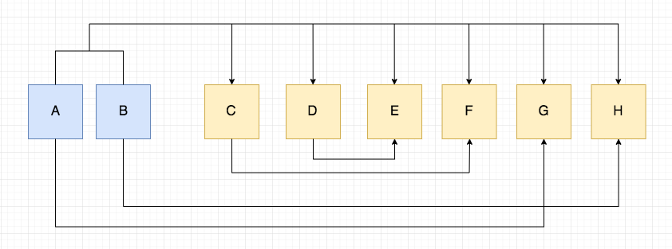
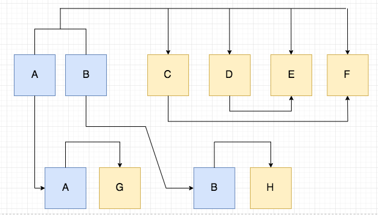
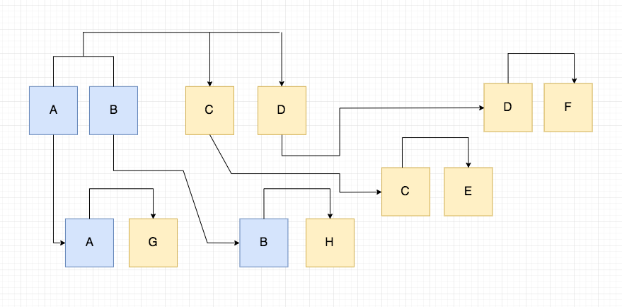

# CS336 (DB) Studyguide
**Disclaimer: I do not own any of the images used in this studyguide, all credit goes to the original creators.**
## Entity Relationships
### One to One
Also denoted 1:1, means that one object is related to at most one other object. Think of it as a coupling. Example: spouse - you can either have zero or one spouse.

One to one relationships are generally implemented as attributes of an entity aka columns in a table.
### One to Many
Also denoted 1:n, means that one object can have a relationship with many other objects. On the contary n:1, means many objects have a relationship wiht one object. Example: make and model - a particular make can have many models and many models belong to a single make.

One to many relationships are generally implemented with a parent table and child table which uses foreign keys that reference the parent's primary key.
### Many to Many
Also denoted n:n, means that many objects can have a relationship with many other objects. Example: authors and books, an author can write many books and a book can by written by multiple authors.

Many to many relationships generally require a bridge table to connect the two entities.
## EER Diagrams
EER Diagrams organizes entities and displays their relationships.

### Notation
#### Entity
* Entities: squares
* Attributes: circle
* Relationships: diamond
* Weak Entity: double line

#### Relationships and Cardinality
* No constraints: simple edge 0..*
* At least one relationship for each instance: thick edge 1..*
* At most one relationship for each instance: edge with arrow 0..1
* Exactly one relationship for each instance: think edge with arrow 1..1


#### Participation
##### Full
Each entity is involved in a relationship, meaning they cannot be null. Represented by double lines.
##### Partial
An entity doesn't always have to be involved in a relationship meaning it could be null. Represented by a single line.


#### Inheritance
Represents the connection between parent and sub entities just like in OOP. Designated by a trianglular shape. 


Disjoint entities mean an object(entry) can only be one type of subclass, example: `Class: Animal --> Subclasses: Tiger, Lion, Elephant`. It is not possible for an animal to be a Tiger and a Lion at the same time.

Cover entities means an object(entry) can belong to multiple subclasses, example: `Class: Employee --> Subclasses: Engineer, Manager`. It is possible for an employee to be both an engineer and a manager.

## Datalog
Datalog is a subset of prolog that can be used to simulate a database management system functions such as querying information.

### Syntax
AND denoted as `,`  
OR denoted as `;`  
NOT denoted as `not` or `\`

### Facts
Denoted `<factname>(<item1>,<item2>,...).` can represent entries in a database table. Note facts always end with a period.

```prolog
likes(cat, fish).
likes(cat, fish)?
> true
likes(cat, broccoli)?
> false
blue(sky).
blue(sky)?
> true
blue(ground)?
> false
```

### Rules
Denoted `<rulename> :- <fact1>, <fact2>...` allow you to construct more facts from existing facts. Rules also end with a period. 

```prolog
likes(ryan, brit).
likes(brit, ryan).
likes(dan, josh).

dating(X, Y) :-
	likes(X, Y),
	likes(Y, X).

friendship(X, Y) :-
	likes(X, Y);
	likes(Y, X).
	
dating(ryan, brit)?
> true
dating(dan, josh)?
> false
```
Here we note that for two people to be dating, they must both like one another. On the otherhand, friendship only requires one person to like the other.


### Atom
An atom is a predicate aka a relation name with variables or constants as arguments. `<perdicate name> :- (<arg1>, <arg2>).` `partOf :- (wheel, car).`

**Convention**: Predicates are capitalized and variables are lower-cased.

### Interpreting Rules
* A variable that appears in the head is considered *distinguised*; otherwise it is *nondistinguished*.
* A rule is considered true if there exists values of nondistinguished variables that make the subgoals of the body true.

Lets say we have the following query:

```prolog
isGrandmaster(X) :- 
	isMaster(X),
	inDivision(X, 1),
	inSeason(X, fall),
	hasHighELO(X)
```
Interpretation: A player X is a grandmaster only if they are currently - ranked master, playing in division 1, playing in the fall season, and has a high ELO. 

## Relational Algebra
### Selection
Represented by sigma `σ`. Allows you to choose certain columns in a table with an condition to filter the rows extracted. 

Example: Given the following table named People,

| name | age |
|------|-----|
| Jim  | 30  |
| Joe  | 20  |
| Josh | 45  |
**Select everyone older than 25.**  
σ<sub>age > 25</sub>
 
**Using the same table select everyone under 40 with the name Joe.**  
σ<sub>age < 40 ∧ name = 'Joe'</sub>
### Projection
Represented by pie `Π`. Allows us to pick certain columns. We can use it in conjunction with select operator further specify what information we need.

Example: Given the following table named Car,

| make   | model  | year |
|--------|--------|------|
| honda  | accord | 2008 |
| toyota | camry  | 2016 |
| nissan | altima | 2010 |

**Get the make and model of all cars made before 2015.**  
Π<sub>make, model</sub>(σ<sub>age < 2015</sub>)

Note that select and project operators can be nested.

### Note About Duplicates
Note that relational algebra does not have duplicates because it works with sets but SQL does as it works with multisets and bags.

### Cross-Product
The cross product operator `×` combines two relations which is equivilent to merging the columns of two tables. Alone cross products aren't very useful but they are the basis of joins.

Example: We have a Employee, Department and Works_For table

| ename | eid |
|-------|-----|
| Jon   | 111 |
| Sue   | 222 |

| dname       | did |
|-------------|-----|
| Sales       | 001 |
| Engineering | 002 |

| eid | did |
|-----|-----|
| 111 | 001 |
| 222 | 002 |

Works_For × Employee

| Employee.eid | did | ename | Works_For.eid |
|--------------|-----|-------|---------------|
| 111          | 001 | Jon   | 111           |
| 222          | 002 | Sue   | 222           |

Works_For × Department

| eid | Works_For.did | dname       | Department.did |
|-----|---------------|-------------|----------------|
| 111 | 001           | Sales       | 001            |
| 222 | 002           | Engineering | 002            |

### Natural Join
The join operator `⋈` allows you to take the cross product of two tables and enforces equality on attributes with the same name and eliminates one copy of duplicate attributes.

Example: We have a Employee, Department and Works_For table

| ename | eid |
|-------|-----|
| Jon   | 111 |
| Sue   | 222 |

| dname       | did |
|-------------|-----|
| Sales       | 001 |
| Engineering | 002 |

| eid | did |
|-----|-----|
| 111 | 001 |
| 222 | 002 |

**Lets find all of the names and ids of employees that work in department 002.**  
Π<sub>ename, eid</sub>(σ<sub>did = 002</sub>(Employee ⋈ Department))

### Theta Join
The theta join (⋈<sub>θ</sub>) is the same as the natural join but it only keeps tuples that satisfy the theta condition. If we wanted to join two tables A and B but we wanted to only keep tuples where A column X in A is greater than column Y in B, we could do: Π<sub>A.X, B.Y</sub>(σ<sub></sub>(Employee ⋈ Department))

### Union
The union operator `∪` combines all the tuples between two tables and discards the duplicates.

There are 3 rules that must be followed for a union operation to be valid:

1. The two tables must have the same number of attributes
2. The attribute domains must be compatible
3. Duplicate tuples must be removed

### Difference
The set difference is denoted by `-` means that we want the difference between two relations. 

Example: We have tables, Player and Winner

| pid | rank  |
|-----|-------|
| 0   | 5     |
| 1   | 1     |
| 2   | 0     |

| pid | score  |
|-----|--------|
| 0   | 100    |
| 1   | 20     |

**Find all the players that have not won.**  
Π<sub>pid</sub>Player - Π<sub>pid</sub>Student

Sometimes we need to use a join back to get more than one attribute.  
**Find all the players that have not won and their rank.**  
Π<sub>pid, rank</sub>((Π<sub>pid</sub>Player - Π<sub>pid</sub>Student) ⋈ Student)

### Intersection
The intersection symbol `∩` defines a relation that has a set of tuples that are in both tables.

Example: We have tables Marine and Marauder

| name   | hp  | c_shields |
|--------|-----|-----------|
| Jim    | 100 | true      |
| Tychus | 50  | false     |

| name  | hp  | concus |
|-------|-----|--------|
| John  | 200 | true   |
| James | 100 | true   |


**Find hp amounts that are the same between marines and marauders.**  
Π<sub>hp</sub>Marine ∩ Π<sub>hp</sub>Marauder

### Rename
The rename operator `ρ` allows you to rename tables or their columns. This allows you to perform self joins and unify schema differences.

Example: We have the table User

| name  | id  | age |
|-------|-----|-----|
| Jay   | 340 | 20  |
| Jack  | 215 | 25  |
| Jason | 056 | 20  |

**Find the pairs of names of users that are the same age.**  
σ<sub>n1 < n2</sub>(ρ<sub>U1(n1, i1, age)</sub>User ⋈ ρ<sub>U2(n2, i2, age)</sub>User)

### Expression Trees
You can illustrate relational algebra expressions by creating expression trees which show the steps taken for a query.


### Further Reading
[https://www.guru99.com/relational-algebra-dbms.html](https://www.guru99.com/relational-algebra-dbms.html)
[https://www.youtube.com/watch?v=GkBf2dZAES0&t=391s](https://www.youtube.com/watch?v=GkBf2dZAES0&t=391s)

## SQL

### SELECT, FROM
The `select` keyword allows you to choose columns from a table. The `from` keyword allows you to choose a table to select from.

```sql
SELECT column1, column2, ... 
FROM table_name;
```

### WHERE
The `where` keyword allows you to specify a condition to filter the rows returned.

```sql
SELECT column1, column2, ...
FROM table_name
WHERE condition;
```
### AND, OR, NOT
The `and`, `or`, and `not` keywords supplement the `where` keyword to allow multiple conditionals. They can be combined together.

```sql
SELECT column1, column2, ...
FROM table_name
WHERE condition1 AND condition2 AND condition3 ...;

SELECT column1, column2, ...
FROM table_name
WHERE condition1 OR condition2 OR condition3 ...;

SELECT column1, column2, ...
FROM table_name
WHERE NOT condition;
```

### ORDER BY
The `order by` keyword allows you to you to order the tuples returned from a query. Defaults to ascending. It is possible to specify multiple columns so they are used to split ties in ordering.

```sql
SELECT column1, column2, ...
FROM table_name
ORDER BY column1, column2, ... ASC|DESC;
```

### IN
In allows you to specify multiple values for a `where` statement.

```sql
SELECT column_name(s)
FROM table_name
WHERE column_name IN (value1, value2, ...);
```

### GROUP BY
The group by operator allows you to group identitcal data from a column into a single one and then do an operation on the other non grouped columns, usually aggregate functions.

```sql
SELECT column1, column2
FROM table_name
WHERE [ conditions ]
GROUP BY column1, column2
ORDER BY column1, column2
```

### HAVING
Basically a `where` keyword but to use with aggregate functions.

```sql
SELECT column_name(s)
FROM table_name
WHERE condition
GROUP BY column_name(s)
HAVING condition
ORDER BY column_name(s);
```

### INSERT INTO
Allow you to insert records into a table.

```sql
INSERT INTO table_name (column1, column2, column3, ...)
VALUES (value1, value2, value3, ...);
```

### UPDATE
Allow you to update records in a table.

```sql
UPDATE table_name
SET column1 = value1, column2 = value2, ...
WHERE condition;
```

### DELETE
Allow you to delete existing records from a table.

```sql
DELETE FROM table_name WHERE condition;
```

### INNER JOIN
Also called equal, or natural joins, it selects tuples with matching values in both tables.

```sql
SELECT column_name(s)
FROM table1
INNER JOIN table2
ON table1.column_name = table2.column_name;
```

### LEFT JOIN
A type of outer join, it returns all of the records from the left table and only the matched records from the right. As a result, some attributes from the left table may be null.

```sql
SELECT column_name(s)
FROM table1
LEFT JOIN table2
ON table1.column_name = table2.column_name;
```

### RIGHT JOIN
Also a type of outer join, it returns all of the records from the right table and only matched records from the left. Some attributes from the right table may be null.

```sql
SELECT column_name(s)
FROM table1
RIGHT JOIN table2
ON table1.column_name = table2.column_name;
```

### FULL JOIN
Another type of out join, the full join combines both the left and right join which means all values are returned. There may be null attributes on both sides.

```sql
SELECT column_name(s)
FROM table1
FULL OUTER JOIN table2
ON table1.column_name = table2.column_name;
```
### Constraints
#### NOT NULL
This constraint means an attribute cannot be left null.

```sql
CREATE TABLE Persons (
    ID int NOT NULL,
    LastName varchar(255) NOT NULL,
    FirstName varchar(255) NOT NULL,
    Age int
);
```
#### UNIQUE
This constraint means an attribute must be unique.

```sql
CREATE TABLE Persons (
    ID int NOT NULL UNIQUE,
    LastName varchar(255) NOT NULL,
    FirstName varchar(255),
    Age int
);
```

#### Primary Key
An attribute designated primary key must both be not null and unique. It allows a row to be specifically identified.

```sql
CREATE TABLE Persons (
    ID int NOT NULL PRIMARY KEY,
    LastName varchar(255) NOT NULL,
    FirstName varchar(255),
    Age int
);
```

##### Composite
A composite primary key means that several columns are used in conjunction to uniquely identify an entity.

```sql
CREATE TABLE Score_Board (
    ContestID int,
    PlayerID int,
    Score int,
    Date date,
    PRIMARY KEY (ContestID, PlayerID, Score, Date),
    FOREIGN KEY (ContestID) REFERENCES Contest (id),
    FOREIGN KEY (PlayerID) REFERENCES Player (id)
);
```

#### Foreign Key
Allows you to reference another table's primary key.

```sql
CREATE TABLE Orders (
    OrderID int NOT NULL PRIMARY KEY,
    OrderNumber int NOT NULL,
    PersonID int FOREIGN KEY REFERENCES Persons(PersonID)
);
```
```sql
CREATE TABLE Score_Board (
    ContestID int,
    PlayerID int,
    Score int,
    Date date,
    PRIMARY KEY (ContestID, PlayerID, Score, Date),
    FOREIGN KEY (ContestID) REFERENCES Contest (id),
    FOREIGN KEY (PlayerID) REFERENCES Player (id)
);
```
##### Composite
It's posible to have a composite foreign key.

```sql
CREATE TABLE Viewer (
	ID int PRIMARY KEY,
	ContestID int,
   	PlayerID int,
   	Score int,
   	Date date,
   	Viewers int,
   	FOREIGN KEY (ContestID, PlayerID, Score, Date) 
   	REFERENCES Score_Board (ContestID, PlayerID, Score, Date)
);
```
#### On Delete, On Update
Typically, when deleting an entry that has a primary key that is being referenced by a child entry, there will be an referential integerty violation.
##### Restrict
The default response, the dbms will issue a warning and execution will stop.
##### Cascade
If the parent entry is updated or deleted, the children entry will also be updated or deleted.
##### Set Null
Will set the foreign key attribute in the child that references the parent entry to null.

```sql
CREATE TABLE BRDG_TBL (
	pk int PRIMARY KEY,
	fk1 int,
	fk2 int,
	fk3 int,
	FOREIGN KEY (fk1) REFERENCES TBL1(pk1) ON DELETE RESTRICT ON UPDATE RESTRICT,
	FOREIGN KEY (fk2) REFERENCES TBL2(pk2) ON DELETE CASCADE ON UPDATE CASCADE,
	FOREIGN KEY (fk3) REFERENCES TBL3(pk3) ON DELETE SET NULL ON UPDATE SET NULL
);
```

## ERD To Schema
Our goal is to change the drawn relationships from a diagram into actual tables with attributes in SQL.
### Reification
Reification is the way we achieve the goal of going from ERD to Schema. A good example would be the implentation of inheritance.

  
Given the following diagram, we implement it several ways.

```sql
-- Denormalized Approach
CREATE TABLE Person (
	id int PRIMARY KEY,
	name varchar(50) NOT NULL,
	age int NOT NULL,
	type enum(Student, Lecturer) NOT NULL,
	grade int,
	salary numeric
);

-- Normalized Approach
CREATE TABLE Person (
	id int PRIMARY KEY,
	name varchar(50) NOT NULL,
	age int NOT NULL,
	type enum(Student, Lecturer) NOT NULL,
);
CREATE TABLE Student (
	sid int PRIMARY KEY,
	pid int,
	grade int,
	FOREIGN KEY pid REFERENCES Person(id)
);
CREATE TABLE Lecturer (
	lid int PRIMARY KEY,
	pid int,
	salary numeric,
	FOREIGN KEY pid REFERENCES Person(id)
);
``` 
Both approaches have their own positives and negatives but satisfies the goal of creating a concrete implementation.

## Functional Dependency Theory
### Super Key
Set of attributes that can be used to determine a tuple uniquely.
### Candidate Key
The minimum set of attributes needed to uniquely identify a tuple. Note a candidate key is always a super key but not vice versa.
### Prime Attribute
A prime attribute is any attribute that is part of a candidate key. A non-prime attribute is any attribute that doesn't appear in a candidate key.

### Foreign Dependencies Overview
* Transitive property where if `A` → `B` and `B` → `C`, means `A` → `C`
* FDs (Foreign Dependencies) are splittable on the right but not on the left.
* Lets say we have:
 * Title, Year → Length
 * Title, Year → Genre
 * Title, Year → Studio
 * This is equivilent to: Title, Year → Length, Genre, Studio
 * However, we can't do the following:
 * Title → Length
 * Year → Length
 * Title → Genre
 * Title → Genre
* All of the attributes on the left are essential inorder to determine the attributes on the right.

### Closure
Given a set of FDs name F, it's closure, F+ is all of the FDs that can be inferred from F.


**Armstrongs Axioms:**

* *Reflexivity*: If `Y` is a subset of `X`, then `X` → `Y`
* *Argumentation*: If `X` → `Y`, then `XZ` → `YZ`
* *Transitivity*: If `X` → `Y` and `Y` → `Z` then `X` → `Z`
* *Union*: If `A` → `B` and `A` → `C` then `A` → `BC`
* *Decomposition*: If `A` → `BC` then `A` → `B` and `A` → `C` 

### Computing Closures of Attributes
To compute a closure for a set of FDs, run through the list of determination rules and union them into the original set.
#### Example

```
Suppose R(A, B, C, D, E)
FD = {AB → C, B → D, C → E, CE → B, AC → B}
Compute (AB)+

Trivially, we know (AB)+ must contain {A, B}
Then we can see that AB → C, so (AB)+ is now {A, B, C}
Notice C → E, so (AB)+ is now {A, B, C, E}
See B → D, so (AB)+ is now {A, B, C, D, E}
At this point we are finished as all of our FDs exist in (AB)+
```
### Finding Keys from FDs
Given R(A, B, C, D, E) with FDs: A → B, BC → E, ED → A

1. Find all the attributes that show up on left hand side: A, B, C, D, E
2. Find all attributes that show up on left and right hand side: A, B, E
3. Find attributes that only show up left hand side: C, D
4. Left hand side attributes form the base. Add other FDs until closure includes all other keys.
 * (CDA)+ = {C, D, A} + (A → B) = {C, D, A, B} + (BC → E) = {C, D, A, B E}
 * (CDB)+ = {C, D, B} + (BC → E) = {C, D, B, E} + (ED → A) = {C, D, B, E, A}
 * (CDE)+ = {C, D, E} + (ED → A) = {C, D, E, A} + (A → B) = {C, D, E, A, B}
5. We can conclude {C, D, A}, {C, D, B}, and {C, D, E} comprise the possible candidate keys.

## Normalization
Normalization refers to the practice of structuring a table so that it reduces data redundancy and improves data integrity.
### Data Anomalies
When a table has too many columns that are non-essential, there runs the risk of many of them being null which leads to problems.
#### Insert
  
In this situation we can't capture any data until we know the EmployeeID because it is the primary key.
#### Update
  
There is redundant information being stored in the office number column. If on update they are not all changed exactly there will be an update anomoly.
#### Deletion
  
If we delete employee John Hunt, we will lose all information related to him, in our case the New York office. This is probably an unwanted consequence.

**Referenced from: [https://www.essentialsql.com/get-ready-to-learn-sql-database-normalization-explained-in-simple-english/](https://www.essentialsql.com/get-ready-to-learn-sql-database-normalization-explained-in-simple-english/)**

### Denormalized
Denormalized data has no restrictions thus making it very ineffecient.

| name | addr1                | addr2             | favbrand          | brandhq                          | rating  | satisfaction          |
|------|----------------------|-------------------|-------------------|----------------------------------|---------|-----------------------|
| John | 12 Houston Dr, Texas | 139 Spring St, NY | Apple, HP, Lenovo | Cupertino, Palo Alto, Quarry Bay | 4, 5, 3 | happy, happy, neutral |
| Jane | 5 York Ave, Boston   | null              | Samsung, Dell     | Seoul, Round Rock                | 4, 5    | happy, happy          |
| John | 5 York Ave, Boston   | null              | Apple, Samsung    | Cupertino, Seoul                 | 3, 5    | neutral, happy        |

#### Problems
1. There is no way to uniquely identify a row.
2. If a customer has less than two addresses, `addr2` is left empty, if a customer a third address, there is no where to insert it.
3. The rows `favbrand`, `brandhq`, `rating`, and `satisfaction` all have multiple values.

### First Normal Form (1NF)
#### Rules
1. Single valued (atomic) values for all attributes/columns.
2. Attribute domans cannot change - values stored must be the same type.
3. Unique name for attributes/columns.
3. No repeating groups - eg: (addr1, addr2)
4. The order you store your data doesn't matter.
5. Rows are uniquely identified by a primary key.

#### Converting to 1NF
1. We can't have repeating groups so `addr1` and `addr2` is changed into a single attribute `addr`.
2. We can't have multiple values in `addr`, `favbrand`, `brandhq`, `rating`, nor `satisfaction` so we'll have to split our current entries so a row only has one value in each attribute.
3. We need to uniquely identify our rows so `id`, `name`, `addr`, `favbrand`, become a composite primary key.

| id | name | addr                 | favbrand | brandhq    | rating | satisfaction |
|----|------|----------------------|----------|------------|--------|--------------|
| 1  | John | 12 Houston Dr, Texas | Apple    | Cupertino  | 4      | happy        |
| 1  | John | 12 Houston Dr, Texas | HP       | Palo Alto  | 5      | happy        |
| 1  | John | 12 Houston Dr, Texas | Lenovo   | Quarry Bay | 3      | neutral      |
| 1  | John | 139 Spring St, NY    | Apple    | Cupertino  | 4      | happy        |
| 1  | John | 139 Spring St, NY    | HP       | Palo Alto  | 5      | happy        |
| 1  | John | 139 Spring St, NY    | Lenovo   | Quarry Bay | 3      | neutral      |
| 2  | Jane | 5 York Ave, Boston   | Samsung  | Seoul      | 4      | happy        |
| 2  | Jane | 5 York Ave, Boston   | Dell     | Round Rock | 5      | happy        |
| 3  | John | 5 York Ave, Boston   | Apple    | Cupertino  | 3      | neutral      |
| 3  | John | 5 York Ave, Boston   | Samsung  | Seoul      | 5      | happy        |
##### Problems
1. There is alot of redundancy in the rows, `id`, `name`, `addr`, `favbrand`.
2. It is recommended but not necessary to decompose `name`, `addr`, and `(favbrand, brandhq, rating)` into their own tables.

**Name**

| id | name |
|----|------|
| 1  | John |
| 2  | Jane |
| 3  | John |

**Address**

| id | address              |
|----|----------------------|
| 1  | 12 Houston Dr, Texas |
| 1  | 139 Spring St, NY    |
| 2  | 5 York Ave, Boston   |
| 3  | 5 York Ave, Boston   |

**Favorite-Brand**

| id | favbrand | brandhq    | rating | satisfaction |
|----|----------|------------|--------|--------------|
| 1  | Apple    | Cupertino  | 4      | happy        |
| 1  | HP       | Palo Alto  | 5      | happy        |
| 1  | Lenovo   | Quarry Bay | 3      | neutral      |
| 2  | Samsung  | Seoul      | 4      | happy        |
| 2  | Dell     | Round Rock | 5      | happy        |
| 3  | Apple    | Cupertino  | 3      | neutral      |
| 3  | Samsung  | Seoul      | 5      | happy        |

##### Problems
1. There is still a lot of redundancy in the `Favorite-Brand` table.

### Second Normal Form (2NF)
#### Rules
1. Table must be in 1NF
2. No **partial dependences** - an attribute that is not a key and is dependent on a single key as opposed to the entire candidate key. Often abstractly depicted as `A` → `B` where `A` is a key attribute and `B` a non-key attribute.

#### Converting to 2NF
1. In the tables `Name` and `Address`, the fields `name` and `address` respectively form a candidate key with the `id` field which means both tables are 2NF compliant.
2. Notice `id` and `favbrand` form a candidate key in the `Favorite-Brand` table.
3. Notice `brandhq` depends on `favbrand` (a key) but not `id` (also a key), which is a violation of 2NF. On the other hand, `rating`, and `satisfaction`, depend on both `id`, and `favbrand`, thus aren't violations.
4. Therefore, we move attribute `brandhq` to a new table, called `Brand`.

**Favorite-Brand**

| id | favbrand | rating | satisfaction |
|----|----------|--------|--------------|
| 1  | Apple    | 4      | happy        |
| 1  | HP       | 5      | happy        |
| 1  | Lenovo   | 3      | neutral      |
| 2  | Samsung  | 4      | happy        |
| 2  | Dell     | 5      | happy        |
| 3  | Apple    | 3      | neutral      |
| 3  | Samsung  | 5      | happy        |

**Brand**

| name    | hq         |
|---------|------------|
| Apple   | Cupertino  |
| HP      | Palo Alto  |
| Lenovo  | Quarry Bay |
| Samsung | Seoul      |
| Dell    | Round Rock |

#### Problems
1. There is still a little bit of redundancy present in the `Favorite-Brand` table.

### Third Normal Form (3NF)
#### Rules
1. Table must be in 2NF
2. There cannot be any **transitive dependencies** - an attribute that depends on an non-key attribute which in turn depends on a key attribute. A common abstract representation would be `A` → `B` → `C` where `B` → `A` is false. In this case, `A` is a key, and `B` and `C` are not.

#### Converting to 3NF
1. Notice that `satisfaction` is determined by `rating` which is in turn determined by `id` and `favbrand`.
2. This makes `satisfaction` a transitive dependency which violates 3NF.
3. Therefore, move `satisfaction` to it's own table `Satisfaction`.

**Favorite-Brand**

| id | favbrand | brandhq    | rating |
|----|----------|------------|--------|
| 1  | Apple    | Cupertino  | 4      |
| 1  | HP       | Palo Alto  | 5      |
| 1  | Lenovo   | Quarry Bay | 3      |
| 2  | Samsung  | Seoul      | 4      |
| 2  | Dell     | Round Rock | 5      |
| 3  | Apple    | Cupertino  | 3      |
| 3  | Samsung  | Seoul      | 5      |

**Satisfaction**

| rating | satisfaction |
|--------|--------------|
| 1      | sad          |
| 2      | sad          |
| 3      | neutral      |
| 4      | happy        |
| 5      | happy        |


#### Abstract Example
We are given a table represented as functional dependencies where `A` and `B` form the candidate key.
 

Notice that `G` is only determined by `A` and `H` is only determined by `B` rather than the entire candidate key. This represents a 2NF violation so we decompose them into seperate tables.
 

Here we can see `F` is determined by `C` and `E` is determined by `D`. Since `C` and `D` are non-keys, but themselves are determined by `A` and `B`, we have identified two transitive dependences. Thus we must further decompose the table.
 
Our table is now in third normal form.

### Boyce–Codd Normal Form (BCNF or 3.5NF)
#### Rules
1. Table must be in 3NF
2. No trivial dependencies - for any dependency `A` → `B`, `A` should be a super key. In other words, a non-prime attribute cannot derive a prime attribute.

#### Non-BCNF Compliant Table
In our table, a professor is only allowed to teach a single subject. A student is taught by multiple professors.

| student_id | subject | professor |
|------------|---------|-----------|
| 101        | Java    | P. Java   |
| 101        | C++     | P. Cpp    |
| 102        | Java    | P. Coffee |
| 103        | C#      | P. Chash  |
| 104        | Java    | P. Java   |

#### Problems
We can see that `student_id` and `subject` form the candidate key. Since a professor is only allowed to teach one subject, we can say `professor` determines `subject`. However, the `professor` attribute is not a superkey (determine all other keys), so we have a BCNF violation. Without normalization, we would have redundancy in the `professor` attribute.

#### Resolution
To fix it we split our table into one containing `student_id` and `subject` and another containing `subject` and `professor`.

**Student**

| student_id | professor |
|------------|-----------|
| 101        | P. Java   |
| 101        | P. Cpp    |
| 102        | P. Coffee |
| 103        | P. Chash  |
| 104        | P. Java   |

**Professor**

| professor | subject |
|-----------|---------|
| P. Java   | Java    |
| P. Cpp    | C++     |
| P. Coffee | Java    |
| P. Chash  | C#      |

## Integrety Constraints
### Constraints
A relationship among data elements that the DBMS enforces.
#### Types of Constraints
##### Keys
###### Single Attribute
Place `PRIMARY KEY` or `UNIQUE` after type in declaration of attribute.

```sql
CREATE TABLE Car (
	vin CHAR(20) PRIMARY KEY,
	parkingID CHAR(20) UNIQUE
);
```
###### Multiattribute Key
Place `PRIMARY KEY (attr1, attr2, ...);` at bottom of table declaration

```sql
CREATE TABLE Attend (
	student_id CHAR(20),
	event_id CHAR(20),
	PRIMARY KEY(student_id, event_id)
);
```
##### Foreign Keys and Referential Integrety
Stipulates information in a tuple added to one table must already exist in a referenced table. Given the schemas:
```sql
CREATE TABLE Student (
	student_id CHAR(20) PRIMARY KEY,
	name VARCHAR(20),
);
CREATE TABLE Event (
	event_id CHAR(20) PRIMARY KEY,
	name VARCHAR(20)
);
CREATE TABLE Attend (
	student_id CHAR(20) REFERENCES Student(student_id),
	event_id CHAR(20) REFERENCES Event(event_id),
	time DATE,
	PRIMARY KEY(student_id, event_id),
);
```
We can expect that whenever we insert a Attend tupple, the `student_id` and `event_id` will already exist in the Student and Event tables. Note that the syntax for referencing a composite key is slightly different: `FOREIGN KEY (Key1, Key2) REFERENCES PrimaryTable (Key1, Key2);`

###### Actions on Update and Delete
* DEFAULT (reject modification)
* CASCADE (makes changes to children)
* SET NULL (sets the attribute to null)
Allows you to specify what happens to children when a parent attribute is updated or removed.

```sql
CREATE TABLE Student (
	student_id CHAR(20) PRIMARY KEY,
	name VARCHAR(20),
);
CREATE TABLE Event (
	event_id CHAR(20) PRIMARY KEY,
	name VARCHAR(20)
);
CREATE TABLE Attend (
	student_id CHAR(20) REFERENCES Student(student_id),
	event_id CHAR(20) REFERENCES Event(event_id),
	time DATE,
	PRIMARY KEY(student_id, event_id),
);
```

##### Value-based constraints on particular attributes
We use the `CHECK` command during attribute declaration to validate a particular attribute.

```sql
CREATE TABLE SENIOR (
	id CHAR(5) PRIMARY KEY,
	age INT CHECK (age > 65),
);
```
##### Tuple-based constraints on several attributes
If we want to check multiple attributes in relation to each other, we can use check at the bottom of the table decoration.

```sql
CREATE TABLE Student (
	id CHAR(5) PRIMARY KEY,
	start_age INT CHECK (start_age >= 0),
	end_age INT CHECK (end_age >= 0),
	CHECK (start_age < end_age)
);
```
##### Assertions: any SQL boolean expression
Assertions are used for global validation that can span multiple tables unlike checks. Lets say we have three tables Honors_section and Normal_section.

### Triggers
Stored procedures that execute when a specified condition occurs. Examples include inserting or updating a tuple.
### Views
### Check
### Assertions